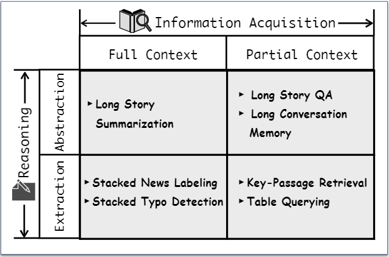
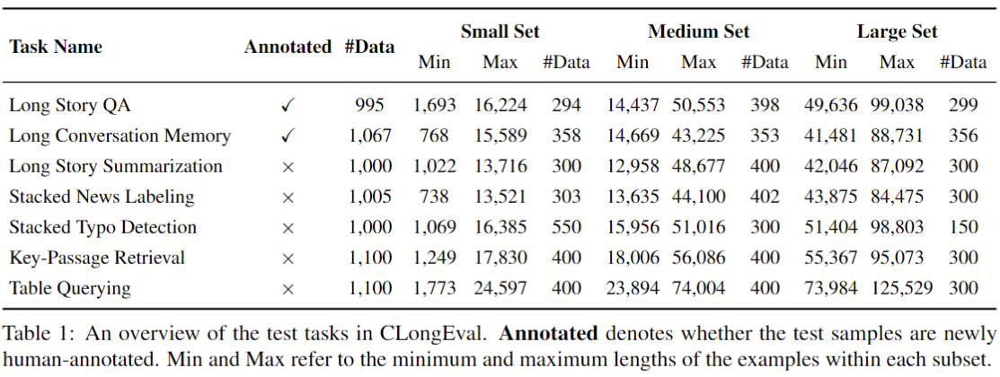

# CLongEval: A Chinese Benchmark for Evaluating Long-Context Large Language Models


**CLongEval** is a Chinese benchmark for evaluating long-context LLMs, which is characterized by three key features: (1) Sufficient data volume, comprising 7 distinct tasks and 7,267 examples; (2) Broad applicability, accommodating to models with context windows size from 1K to 100K; (3) High quality, with over 2,000 manually annotated question-answer pairs in addition to the automatically constructed labels. 

<div align="center">

</div>


## Dataset Statistics

The image below presents statistics for each task.  We stratify the benchmark into small, medium, and large subsets. The small set primarily includes test data with lengths ranging from 1K to 16K tokens, the medium set mainly encompasses lengths from 16K to 50K tokens, and the large set primarily extends from 50K to 100K tokens.

<div align="center">

</div>


## Benchmark Results 

The tables below display model scores across three subsets using automated evaluation metrics. Evaluations for GLM-4-128K were conducted up to the cut-off date of February 21, 2024, whereas those for other models were completed by February 15, 2024.

### Small Set

|                   | LStQA     | LCvMem    | LStSum    | StNLab    | StTDet    | KpRet     | TblQry    |
| ----------------- | --------- | --------- | --------- | --------- | --------- | --------- | --------- |
| Zh-LLAMA2-7B-64K  | 29.34     | 41.40     | 10.29     | 0.59      | 0         | 2.86      | 7.50      |
| Zh-Alpaca2-7B-64K | 35.52     | 29.34     | 14.29     | 4.97      | 0.09      | 6.39      | 9.75      |
| Qwen-7B-32K       | 31.94     | 47.71     | 11.20     | 4.31      | 0         | 11.18     | 6.64      |
| ChatGLM3-6B-32K   | 49.36     | 53.40     | 16.37     | 0.46      | 0.91      | 33.67     | 22.60     |
| InternLM2-7B-32K  | 49.55     | 58.34     | 17.29     | 16.46     | 2.27      | 21.87     | 20.75     |
| InternLM2-20B-32K | 53.82     | 57.41     | 17.00     | 11.16     | 0.91      | 34.97     | 17.25     |
| GLM-4-128K        | 52.74     | 46.74     | 20.29     | 87.93     | 17.40     | 81.47     | 73.25     |
| Mooshot-v1-32K    | 60.21     | 51.76     | 21.56     | **89.01** | 25.36     | **86.74** | 66.50     |
| GPT-4-Turbo-128K  | **66.19** | **63.42** | **21.96** | 79.70     | **38.35** | 84.24     | **82.35** |


### Medium Set

|                    | LStQA     | LCvMem    | LStSum    | StNLab    | StTDet    | KpRet     | TblQry    |
| ------------------ | --------- | --------- | --------- | --------- | --------- | --------- | --------- |
| Zh-LLAMA2-7B-64K   | 16.90     | 26.30     | 7.74      | 0         | 0         | 1.21      | N/A       |
| Zh-Alpaca2-7B-64K  | 18.41     | 22.45     | 8.56      | 0         | 0         | 0.93      | N/A       |
| InternLM2-7B-200K  | 29.59     | 32.07     | 8.13      | 0         | 0         | 1.45      | 4.50      |
| InternLM2-20B-200K | 25.13     | 36.84     | 13.99     | 0         | 0         | 1.64      | 6.25      |
| Moonshot-v1-128K   | 51.20     | 38.29     | **18.81** | **86.30** | **11.33** | **78.64** | **66.50** |
| GPT-4-Turbo-128K   | **52.63** | **54.18** | 17.38     | 37.40     | 9.32      | 22.34     | 52.76     |


### Large Set

|                    | LStQA     | LCvMem    | LStSum    | StNLab    | StTDet   | KpRet     | TblQry    |
| ------------------ | --------- | --------- | --------- | --------- | -------- | --------- | --------- |
| InternLM2-7B-200K  | 19.03     | 18.16     | 2.36      | 0         | 0        | 0.89      | 2.67      |
| InternLM2-20B-200K | 15.62     | 28.39     | 8.31      | 0         | 0        | 0.51      | 0.67      |
| Moonshot-v1-128K   | **41.52** | **32.59** | **16.38** | **78.48** | **4.33** | **51.50** | **52.00** |


## Reproducing Main Results

### Downloading Data

We have uploaded CLongEval to Hugging Face. The files can be downloaded from [this link](https://huggingface.co/datasets/zexuanqiu22/CLongEval) and manually put into the `data` directory.


### Inference

We use the `lmdeploy` framework for InternLM2 series inference, huggingface's native methods for Qwen-7B-32K inference, and the `vllm` framework for other open-source model inference. Please modify the  model path in  `config/model2path.json` before performing inference to ensure proper loading of the models from the local path. Our code is adapted and modified based on [LongBench](https://github.com/THUDM/LongBench/tree/main).


Take InternLM2-7B as an example,
For single-GPU inference, use the following command:

```python
python inference.py --model_name internlm2-7b-200k --size small.jsonl --dataset_name long_story_qa --gpu_memory_utilization 0.8 --tensor_parallel_size 1 --gpus "0"
```

For multi-GPU inference, use the following command:

```python
python inference.py --model_name internlm2-7b-200k --size small.jsonl --dataset_name long_story_qa --gpu_memory_utilization 0.8 --tensor_parallel_size 2 --gpus "0,1"
```

You can check `inference_example.sh` that shows the complete commands to run the Inference for InternLM2-7B and obtain all results. After the above command is complete,  the inference results will be saved in `inference_results/internlm2-7b-200k/`. Additionally, we also provide the inference results of GPT-4-Turbo and Moonshot-v1 in `inference_results/`. 

### Evaluation 

Use the following command to obtain the model's performance on a specific dataset:

```python
python eval.py --model_name internlm2-7b-200k --datasets long_story_qa
```

The evaluated scores will be saved into the `eval_results/intenlm2-7b-200k/`. 


## Reproducing Visualization

- To reproduce Figure 2 (Performance w.r.t Answer Position) of the paper, please refer to the code and instructions provided in the `lost_in_the_middle` folder.

- To reproduce Figure 3 (Performance change analysis of GPT-4-Turbo on StNLab) and Figure 4 (Performance change analysis of Moonshot-v1 on StNLab) of the paper, please refer to the code and instructions provided in the `heat_map` folder.


## Citation

If you find CLongEval useful in your research, please consider citing:

```
@misc{qiu2024clongeval,
      title={CLongEval: A Chinese Benchmark for Evaluating Long-Context Large Language Models}, 
      author={Zexuan Qiu and Jingjing Li and Shijue Huang and Wanjun Zhong and Irwin King},
      year={2024},
      eprint={2403.03514},
      archivePrefix={arXiv},
      primaryClass={cs.CL}
}
```


## Acknowledgement

- We are grateful for the support from [Moonshot AI](https://www.moonshot.cn/) for providing a complimentary token budget, enabling us to utilize Moonshot-v1-128K for testing on both the Medium and Large Sets.